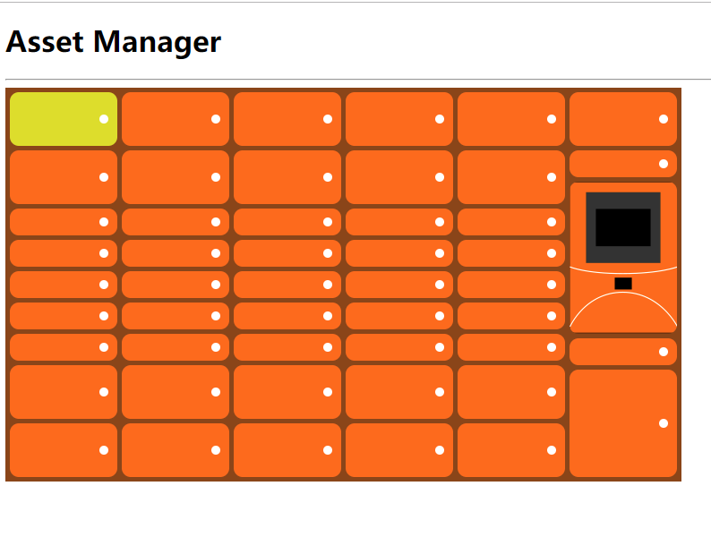

# asset-manager

Asset Manager是一个包裹交付管理系统，由几个组件组成。有一个用于管理储物柜的Web管理门户。

## 目录说明

* asset-manager-web 目前版本未使用到
  * 开始的想法使用vue脚手架工具搭建vue工程，由于很久未写过前端代码，过于生疏，最终选择使用最简单的方法实现；后面排期加上；
* asset-manager-service 用于存放服务端源代码,和前段发布代码
  * 前段使用：Vue.js，axios.js
  * 服务端使用：SpringMVC,XStream,GSON,LOG4J
  * JDK 1.8 , TOMCAT 8.5

## 问题

1. 目前只支持单个储物柜点击事件；（举例：如果点击A1货柜，且闪烁未结束，点击A2货柜则无效）
